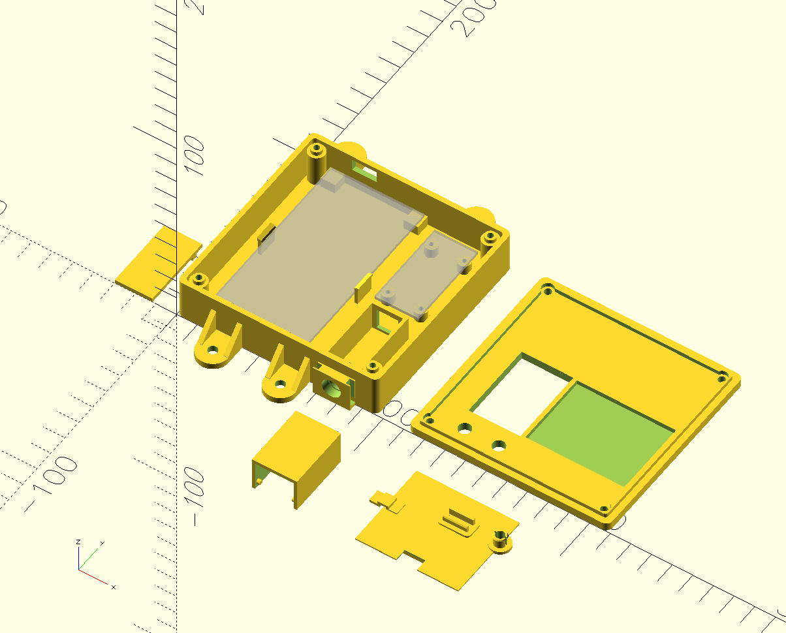

These two designs are OpenSCAD mounting box for the RFID controller and a Buck Converter.

I printed them in PLA and that should work but if the power brick generates too much heat may need to reprint in PETG or other.

Figure 1. The OpenSCAD render

Here's the printed cases. The controller board snaps into place and has offset posts holding it off the bottom of the case. The Buck Converter is screwed in with 2.5mm screws. The female jack is mounted inside the base and a lid press fits to hold that in place. The RFID antenna sits in a cavity in the lid. There's a cover that's glued on to hold it in place. The model also includes plugs for the controller USB-C port and RST/BOOT buttons.

Figure 2. 3D-Printed CASE with electronics Mounted
